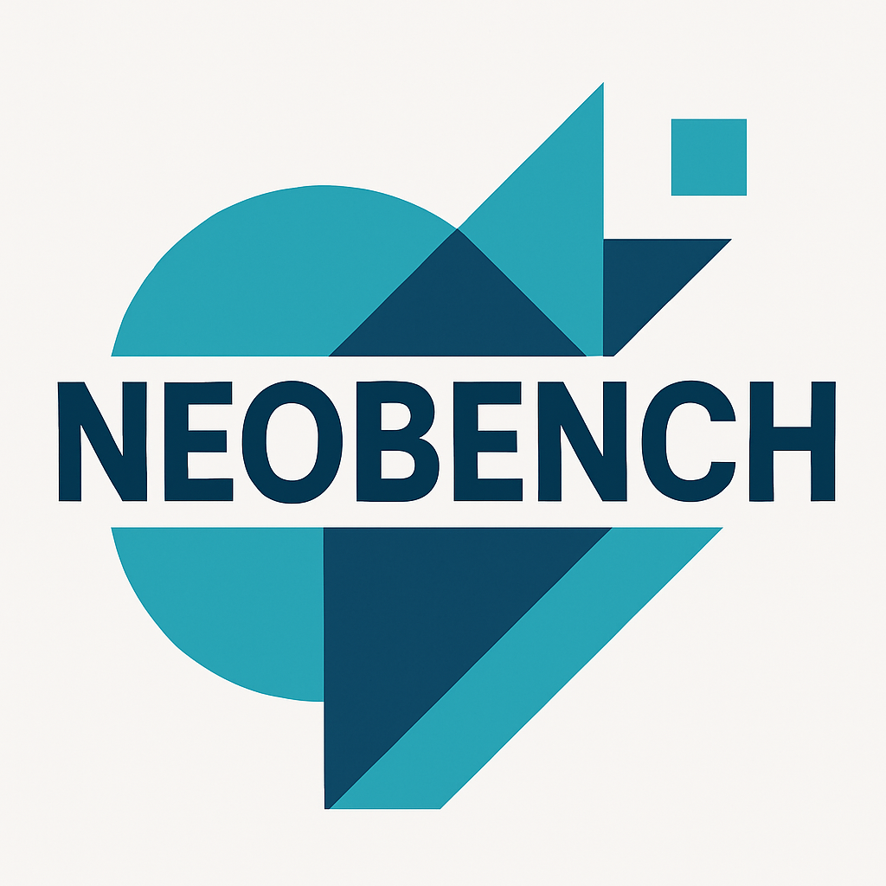

# NeoBench OS: The Ultimate m68k Professional Environment

NeoBench is a next-generation operating system environment for the Motorola 68000 series (m68k) architecture, specifically optimized for Amiga hardware. It provides a unique dual-kernel architecture that bridges the gap between classic bare-metal performance and professional modern kernel services.

---

## 🌟 Project Vision
To provide a unified, futuristic, and high-performance desktop experience for Amiga enthusiasts and power users, combining the aesthetic of modern professional operating systems with the legendary hardware of the m68k era.

---

## 🏗️ System Architecture: Dual-Kernel Integration

NeoBench is delivered as an integrated environment with two distinct operating modes:

### 1. NeoBench PRO (Linux-Powered)
A professional-grade environment based on an optimized Linux m68k kernel.
- **Windows-Quality Boot:** A cinematic, slow-paced initialization sequence with professional component logging.
- **Advanced Driver Support:**
  - **Mediator PCI:** Custom foundational bridge for Elbox Mediator busboards.
  - **PowerPC Coprocessor:** Native PCI driver for Sonnet/Crescendo PPC accelerators.
  - **Audigy Sound Blaster:** Integrated ALSA drivers for high-fidelity audio via PCI.
  - **Modern Connectivity:** Built-in support for USB Mass Storage, CD-ROM (ISO9660), and Networking (X-Surf 100).

### 2. NeoBench Desktop (Bare Metal)
The classic, ultra-responsive GUI environment shown in the project's flagship photography.
- **Bare Metal Kernel:** Direct hardware control for maximum performance.
- **Modern GUI:** High-fidelity desktop with taskbar, start menu, and "Aero-style" aesthetics.
- **Native m68k Suite:** A massive collection of custom-built applications.

---

## 📱 The NeoBench App Suite
NeoBench comes pre-loaded with a professional software collection, including:
- **Productivity:** NeoWrite, NeoCalc, NeoCalendar, NeoPresent.
- **Development:** NeoAsm, NeoDebug, NeoHex, NeoGit.
- **Internet:** NeoBrowse, NeoMail, NeoIRC, NeoFTP.
- **Multimedia:** NeoPlayer, NeoTracker, NeoPaint, NeoAnim.
- **Utilities:** File Manager, System Monitor, DiskTools, NeoZip.
- **Entertainment:** NeoChess, NeoMines, NeoTetris, NeoSnake.

---

## 🛠️ Hardware Requirements
- **Architecture:** Motorola 68020/030/040/060.
- **Platform:** Amiga (AGA Chipset recommended).
- **Expansion (Optional):**
  - Elbox Mediator PCI Busboard.
  - Sound Blaster Audigy / Live! PCI Card.
  - PowerPC PCI Accelerator (Sonnet Crescendo).
  - X-Surf 100 / Zorro / PCMCIA Network Cards.

---

## 🚀 Getting Started

### 1. Booting the Environment
Launch the system using the provided FS-UAE configuration (`NeoBench_DE.fs-uae`). On startup, you will be presented with the **NeoBench System Loader**:
- **Press 1:** Boot into **NeoBench PRO** (Linux-based professional environment).
- **Press 2:** Boot into **NeoBench Desktop** (Bare Metal classic environment).

### 2. Manual Kernel Deployment
If you are deploying to physical hardware:
- The Linux PRO kernel is located at `/vmlinux`.
- The Bare Metal kernel is located at `/neobench.bin`.
- Use the `amiboot` loader for the PRO environment.

---

## ⚖️ Copyright & Legal
**NeoBench OS v1.0.0-PRO**
Copyright (c) **Lord Protector 2026**. All rights reserved.
NeoBench is a registered trademark of the NeoBench Project.
